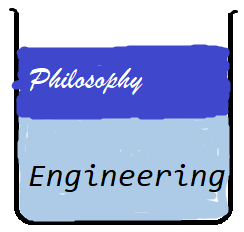

Well. Finally got around to putting this old website together. Neat thing about it - powered by [Jekyll](http://jekyllrb.com) and I can use Markdown to author my posts. It actually is a lot easier than I thought it was going to be!

Picture test with Dropbox [OilAndWater](https://www.dropbox.com/s/e8mb3rfiybll6ni/OilAndWater.png?dl=0)

Picture test from within github 

Picture? Link? Or just a URL?
[[https://github.com/existential-engineer.github.io/blob/assets/images/OilAndWater.png|alt=OilAndWater]]
